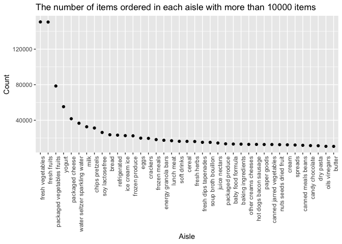
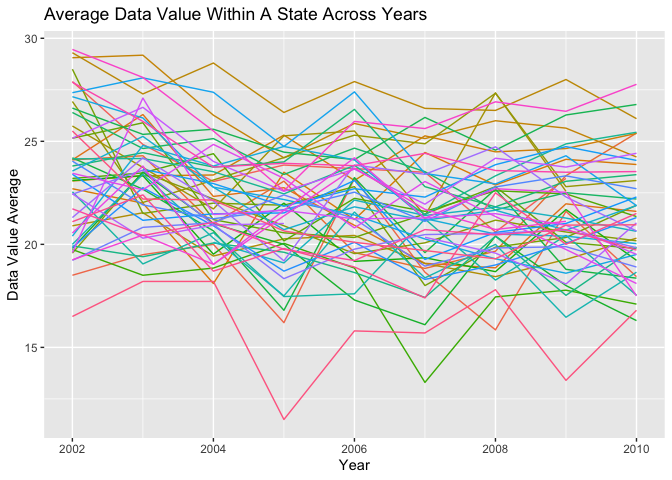
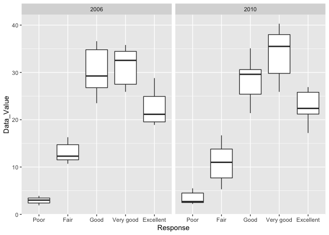
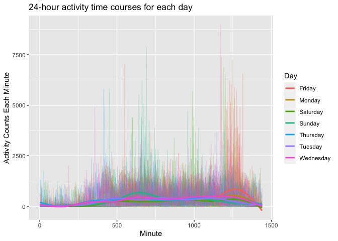

P8105\_HW3\_hx2306
================
HuijunXiao
10/18/2021

### Problem 1

-   Step 1: Load data from P8105.dataset.

``` r
library(p8105.datasets)
data("instacart")
```

-   Step 2: Short description of the dataset.

``` r
# How many aisles are there, and which aisles are the most items ordered from?
aisles <-
  instacart %>%
  count(aisle) %>%
  arrange(desc(n))
```

The `instacart` dataset contains 15 variables, which are order\_id,
product\_id, add\_to\_cart\_order, reordered, user\_id, eval\_set,
order\_number, order\_dow, order\_hour\_of\_day,
days\_since\_prior\_order, product\_name, aisle\_id, department\_id,
aisle, department, and 1384617 rows of observations. For aisles, there
are 134 kinds of aisles, and the most items are ordered from
`fresh vegetables` with n = 150609. The second is `fresh fruits` with n
= 150473. The third is `packaged vegetables fruits` with n = 78493.
There are 39123 products in total.

-   Step 3: Make a plot.

``` r
# Make a plot that shows the number of items ordered in each aisle, limiting this to aisles with more than 10000 items 
aisles_plot <-
  aisles %>%
  filter(n > 10000) %>%
  mutate(aisle = fct_reorder(aisle,desc(n))) %>%   #reorder in ggplot
  ggplot(aes(x =aisle, y = n)) + 
  geom_point() + 
  theme(axis.text.x = element_text(angle = 90, hjust = 1)) +
  xlab("Aisle") +
  ylab("Count") + 
  ggtitle("The number of items ordered in each aisle with more than 10000 items")

aisles_plot
```

<!-- -->

-   Step 4: Make a table.

``` r
# Make a table showing the three most popular items in each of the aisles “baking ingredients”, “dog food care”, and “packaged vegetables fruits”. Include the number of times each item is ordered in your table.
aisle_item <-
  c("baking ingredients", "dog food care", "packaged vegetables fruits")

aisle_table <- 
  instacart %>%
  filter(aisle %in% aisle_item) %>%
  select(product_name, aisle) %>%
  group_by(aisle) %>% 
  count(product_name) %>%
  arrange(desc(n), .by_group = TRUE) %>%
  mutate(rank_item = order(n, decreasing = TRUE)) %>%     #rank for three most popular items in each aisle 
  filter(rank_item <= 3) %>%
  relocate(rank_item,aisle, product_name,n) %>%
  rename(Aisle = aisle,
         `Product Name` = product_name,
         Count = n,
         Rank = rank_item) 

knitr::kable(aisle_table) 
```

| Rank | Aisle                      | Product Name                                  | Count |
|-----:|:---------------------------|:----------------------------------------------|------:|
|    1 | baking ingredients         | Light Brown Sugar                             |   499 |
|    2 | baking ingredients         | Pure Baking Soda                              |   387 |
|    3 | baking ingredients         | Cane Sugar                                    |   336 |
|    1 | dog food care              | Snack Sticks Chicken & Rice Recipe Dog Treats |    30 |
|    2 | dog food care              | Organix Chicken & Brown Rice Recipe           |    28 |
|    3 | dog food care              | Small Dog Biscuits                            |    26 |
|    1 | packaged vegetables fruits | Organic Baby Spinach                          |  9784 |
|    2 | packaged vegetables fruits | Organic Raspberries                           |  5546 |
|    3 | packaged vegetables fruits | Organic Blueberries                           |  4966 |

-   Step 5: Make a table.

``` r
# Make a table showing the mean hour of the day at which Pink Lady Apples and Coffee Ice Cream are ordered on each day of the week; format this table for human readers (i.e. produce a 2 x 7 table).
aisle_item2 <-
  c("Pink Lady Apples","Coffee Ice Cream")

aisle_table2 <- 
  instacart %>%
  filter(product_name %in% aisle_item2) %>%
  select(product_name,order_dow,order_hour_of_day) %>%
  group_by(product_name,order_dow) %>%
  summarise(mean_hour = mean(order_hour_of_day)) %>%
  pivot_wider(
        names_from = order_dow,
        values_from = mean_hour) %>%
  rename(`Product Name` = product_name)
```

    ## `summarise()` has grouped output by 'product_name'. You can override using the `.groups` argument.

``` r
knitr::kable(aisle_table2,digits = 3) 
```

| Product Name     |      0 |      1 |      2 |      3 |      4 |      5 |      6 |
|:-----------------|-------:|-------:|-------:|-------:|-------:|-------:|-------:|
| Coffee Ice Cream | 13.774 | 14.316 | 15.381 | 15.318 | 15.217 | 12.263 | 13.833 |
| Pink Lady Apples | 13.441 | 11.360 | 11.702 | 14.250 | 11.552 | 12.784 | 11.938 |

### Problem 2

-   Step 1: Data cleaning.

``` r
data("brfss_smart2010")

brfss_smart2010 <-
  brfss_smart2010 %>%                                #format the data to use appropriate variable names
  rename(State = Locationabbr,
         Location = Locationdesc,
         Data_Value = Data_value, 
         Confidence_Limit_Low = Confidence_limit_Low,
         Confidence_Limit_High = Confidence_limit_High,
         Display_Order = Display_order,
         Data_Value_Unit = Data_value_unit,
         Data_Value_Type = Data_value_type, 
         Data_Source = DataSource,
         Class_Id = ClassId,
         Topic_Id = TopicId,
         Location_ID = LocationID,
         Question_ID = QuestionID,
         RESP_ID = RESPID,
         Location_Geo = GeoLocation) %>%
  filter(Topic == "Overall Health") %>%                #focus on the “Overall Health” topic
  filter(Response == "Excellent" |
           Response == "Fair" |
           Response == "Good" |
           Response == "Very good"|
           Response == "Poor") %>%                     #include only responses from “Excellent” to “Poor”
  mutate( 
    Response = factor(
      Response,
      levels = c("Poor","Fair","Good","Very good","Excellent")))  #organize responses as a factor taking levels ordered from “Poor” to “Excellent”
```

-   Step 2: Which states were observed at 7 or more locations

``` r
#In 2002, which states were observed at 7 or more locations? What about in 2010?
state_2002 <- 
  brfss_smart2010 %>%
  filter(Year == "2002")%>%           #year 2002
  count(State,Location) %>%
  group_by(State) %>%
  tally() %>%                         #count state locations
  filter( n >= 7)                     #7 or more locations

state_2010 <- 
  brfss_smart2010 %>%
  filter(Year == "2010")%>%           #year 2010
  count(State,Location) %>%
  group_by(State) %>%
  tally() %>%                         #count state locations
  filter( n >= 7)                     #7 or more locations
```

In 2002, there are only 6 states were observed at 7 or more locations,
which are CT, FL, MA, NC, NJ, PA. In 2010, there are only 14 states were
observed at 7 or more locations, which are CA, CO, FL, MA, MD, NC, NE,
NJ, NY, OH, PA, SC, TX, WA.

-   Step 3: Construct a dataset that is limited to Excellent responses,
    and contains, year, state, and a variable that averages the
    data\_value across locations within a state.

``` r
#dataset
exc_response <-
  brfss_smart2010 %>%
  filter(Response == "Excellent") %>%
  select(Year,State,Data_Value)%>%
  group_by(Year, State) %>%
  summarise(Mean_Data_Value = mean(Data_Value)) %>%
  ggplot(aes(x = Year,                                        #spaghetti plots
           y = Mean_Data_Value, 
           group = State, 
           color = State)) +
  geom_line() + 
  ggtitle("Average Data Value Within A State Across Years") +
  ylab("Data Value Average") +
  labs(color = "State") + 
  theme(legend.position = "none")
```

    ## `summarise()` has grouped output by 'Year'. You can override using the `.groups` argument.

``` r
exc_response
```

    ## Warning: Removed 3 row(s) containing missing values (geom_path).

<!-- -->

Based on the plot, the average data value of these states are slightly
decreasing in general. CT has relatively the highest average data value
line across years from 2002 to 2010, and WV has the lowest average data
value line across years from 2002 to 2010.

-   Step 4: Make a two-panel plot.

``` r
NY_state_plot <-
  brfss_smart2010 %>%
  filter(State == "NY",
         Year == "2006" | Year == "2010") %>%
  ggplot(aes(x = Response , y = Data_Value)) +
  geom_boxplot() +
  facet_grid(.~Year)                                       #combine two plots

NY_state_plot
```

<!-- -->

For the response of `Poor`, the data value interquartile range of 2010
is lager than that of 2006, but has lower median. Same situation happens
for the response of `Fair`. The interquartile range of `Good` response
in 2010 is smaller than that in 2006, but 2010 has higher median. For
both `Very good` and `Excellent` responses, 2010 has higher data value,
although the interquartile ranges are similar.

### Problem 3

-   Step 1: Load, tidy, and otherwise wrangle the data.

``` r
accel_data <-
  read.csv("./dataset/accel_data.csv") %>% 
  janitor::clean_names() %>%                                    #has useful variable names
  pivot_longer(activity_1:activity_1440,                        #pivot longer 
               names_to = "Time(minute)",
               values_to = "Activity_Counts") %>%
  mutate(Weekday_vs_Weekend =                                   #weekday vs weekend variable
           case_when(
             day %in% c("Monday","Tuesday","Wednesday","Thursday","Friday") ~ "Weekday",
             day %in% c("Saturday","Sunday") ~ "Weekend")) %>%
  rename(Week = week,
         Day_ID = day_id,
         Day = day) %>%
  mutate(`Time(minute)` = str_remove(`Time(minute)`,"activity_"),
         `Time(minute)` = as.numeric(`Time(minute)`))
```

This dataset contains 6 variables, which are Week, Day\_ID, Day,
Time(minute), Activity\_Counts, Weekday\_vs\_Weekend, and 50400 rows of
observations. It includes five weeks of accelerometer data collected on
a 63-year-old male with BMI 25, who was admitted to the Advanced Cardiac
Care Center of Columbia University Medical Center and diagnosed with
congestive heart failure (CHF).

-   Step 2: Traditional analyses of accelerometer data focus on the
    total activity over the day.

``` r
# aggregate across minutes to create a total activity variable for each day
total_act <-
  accel_data %>%
  group_by(Week, Day) %>%
  summarise(sum(Activity_Counts)) %>%
  rename(Total_Activity = `sum(Activity_Counts)`) %>%
  pivot_wider(
    names_from = Day,
    values_from = Total_Activity) %>%
  relocate(Week,Monday,Tuesday,Wednesday,Thursday,Friday,Saturday,Sunday)
```

    ## `summarise()` has grouped output by 'Week'. You can override using the `.groups` argument.

``` r
# create a table showing these totals
knitr::kable(total_act) 
```

| Week |    Monday |  Tuesday | Wednesday | Thursday |   Friday | Saturday | Sunday |
|-----:|----------:|---------:|----------:|---------:|---------:|---------:|-------:|
|    1 |  78828.07 | 307094.2 |    340115 | 355923.6 | 480542.6 |   376254 | 631105 |
|    2 | 295431.00 | 423245.0 |    440962 | 474048.0 | 568839.0 |   607175 | 422018 |
|    3 | 685910.00 | 381507.0 |    468869 | 371230.0 | 467420.0 |   382928 | 467052 |
|    4 | 409450.00 | 319568.0 |    434460 | 340291.0 | 154049.0 |     1440 | 260617 |
|    5 | 389080.00 | 367824.0 |    445366 | 549658.0 | 620860.0 |     1440 | 138421 |

The trends are not apparent based on the table. In the first week, the
total activity increases over the week (from Monday to Sunday) in
general. The same situation happens in the second week. However, during
Week 3, Monday has the highest total activity. We also cannot conclude
that weekdays usually have lower total activity than weekends, since,
for Week 4 and 5 weekends, their total activity values are all below
300,000.

-   Step 3: The inspection activity over the course of the day.

``` r
# Make a single-panel plot that shows the 24-hour activity time courses for each day
day_plot <-
  ggplot(accel_data, 
         aes(x = `Time(minute)`, y = Activity_Counts, group = Day_ID, color = Day)) + 
  # use color to indicate day of the week
  geom_line(alpha = .2) +
  geom_smooth(aes(group = Day), se = FALSE) +
  ggtitle("24-hour activity time courses for each day") +
  xlab("Minute") +
  ylab("Activity Counts Each Minute") 

day_plot
```

    ## `geom_smooth()` using method = 'gam' and formula 'y ~ s(x, bs = "cs")'

<!-- -->

Based on the plot, we can tell that this subject had higher total
activity counts at the beginning or the end (close to) of the day. On
average, Friday and Wednesday have higher total activity for each minute
at the beginning of the day, and Sunday and Saturday have higher total
activity for each minute at the end of the day. In the middle period of
the day, the subject’s total activity is relatively lower.
